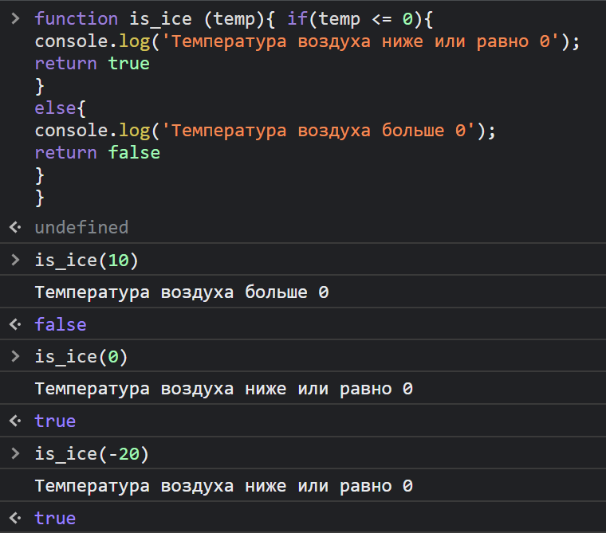
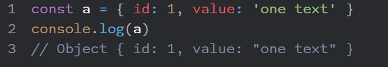
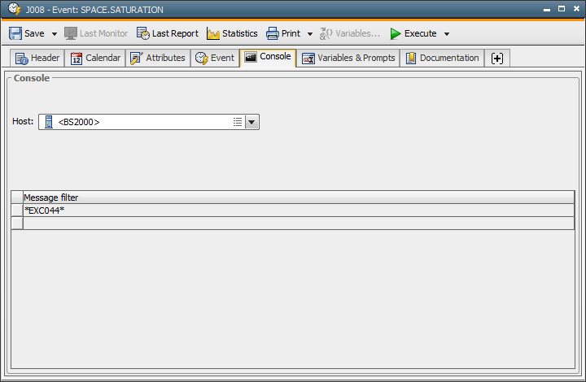

# Что такое JavaScript (JS)?

---
### JavaScript – это язык программирования, который используют разработчики для создания интерактивных веб-страниц. Функции JavaScript могут улучшить удобство взаимодействия пользователя с веб-сайтом: от обновления ленты новостей в социальных сетях и до отображения анимации и интерактивных карт. JavaScript является языком программирования при разработки скриптов для выполнения на стороне клиента, что делает его одной из базовых технологий во всемирной сети Интернет. Например, карусель изображения, выпадающее по клику меню и динамично меняющиеся цвета элементов на веб-странице, которые вы видите во время просмотра страниц в Интернете, выполнены при помощи JavaScript.
---
# Node.js

---
### Node или Node.js (читается: ноуд или ноуд-джей-эс) — программная платформа, основанная на движке V8 (компилирующем JavaScript в машинный код), превращающая JavaScript из узкоспециализированного языка в язык общего назначения. Node.js добавляет возможность JavaScript взаимодействовать с устройствами ввода-вывода через свой API, написанный на C++, подключать другие внешние библиотеки, написанные на разных языках, обеспечивая вызовы к ним из JavaScript-кода. Node.js применяется преимущественно на сервере, выполняя роль веб-сервера, но есть возможность разрабатывать на Node.js и десктопные оконные приложения (при помощи NW.js, AppJS или Electron для Linux, Windows и macOS) и даже программировать микроконтроллеры (например, tessel, low.js и Espruino). В основе Node.js лежит событийно-ориентированное и асинхронное (или реактивное) программирование с неблокирующим вводом/выводом.
---
# Что такое consolle.log ?

## console.log() — это метод, предназначенный для печати в консоль браузера.
### При написании скриптов иногда нужно увидеть промежуточный результат прямо в консоли браузера — это просто, удобно и не требует никакой дополнительной логики для отображения.
-----

---
# Const (программирование)
### В языках программирования C, C++, C# и D const является квалификатором типа:[a] ключевое слово применяется к типу данных, показывая, что данные константны (неизменяемы). Это может быть использовано при объявлении (декларировании) констант. Отличительная особенность const в C-подобных языках программирования проявляется при его комбинировании с типами данных, что дает сложное поведение в сочетании с указателями, ссылками, составными типами данных и при проверке типов.
---
# Содержание [скрыть]
### 1	Введение
### 2	Следствия
### 3	Другие варианты использования
### 4	Синтаксис
### 4.1	Простые типы данных
### 4.2.1	Соглашения по записи в языке C
### 5	Примечания
---
# Console Tab ?
1. Object: Event
2. Object class: Executable object
3. Object type (short name): EVNT
---
# Event type "Console" currently supports the monitoring of:
* Console output in BS2000.
* Console output in z/OS (Multiple Console Support - MCS).
* Message queue in OS/400.
* Events in SAP.
* Status changes of XI communication channels. 
* Windows Event Viewer.
---
## The event monitors the target system according to the specifications made in this tab. The script statements and functions that are specified in the !Process tab are executed if conditions such as the Event ID or message filter apply.
1. Occurring events of type "Console" are always in the status "Sleeping."
2. Message filter specifications must always start with a wildcard character.
---

---
# Что такое var в JavaScript?
### Оператор var служит для объявления переменных.

### Типы переменных в языке JavaScript не объявляются очевидно, тем не менее они присутствуют. Интерпретатор понимает что записывается в переменную и на основании этого добавляет тип к этой переменной.
---
### В ходе программы мы можем перезаписывать значение переменной, при этом мы можем указывать новый тип переменной.
### К примеру, изначально был записан тип float (число с точкой), но потом можно записать другой тип данных:
---
* var first_num = 23.2 // Тип данных float
* var first_num = "1" // Тип данных string
---
# Ниже приводим несколько существующих типов данных в языке JavaScript:
* var some = 1 Integer - целые числа;
* var some = 1.12 Float - числа с плавающей точкой;
* var some = "Привет" String - строки;
* var some = true Boolean - принимают только true или же false.
---
# Что такое let в JavaScript?
### В JavaScript ключевое слово let используется для объявления переменных в блоке области видимости. let позволяет создавать переменные, ограничивая их область видимости только блоком, в котором они объявлены.
---
1. let num = 5;
2. num++;
3. console.log(num);
---
# Разница между «var», «let» и «const» в JavaScript
# Var
### Переменные, объявленные при помощи var, могут иметь как глобальную, так и локальную область видимости.
* Глобальная область видимости — переменная объявлена вне функции.
* Локальная область видимости — доступ к переменной только в рамках определенной функции.
---
### Рассмотрим пример

#### В этом примере a имеет глобальную область видимости, потому что существует вне функции. А вот область видимости b — локальна. Мы не имеем доступа к переменной b вне функции, в которой она объявлена. Поэтому, если сделаем так, то получим ошибку:

---
# Let
### Оператор let — это улучшенный вариант var. В отличие от var, let имеет блочную область видимости. Переменная, объявленная в блоке кода при помощи оператора let, доступна только в рамках этого блока кода.

### Таким образом, использование переменной c вне ее блока (т. е., за пределами кода, ограниченного фигурными скобками, в котором была объявлена переменная) приводит к ошибке. Произошло это потому, что переменные, объявленные при помощи let, имеют блочную область видимости.
---
# Const
### Ключевое слово const — это сокращение от слова "константа". Как и в случае с let, у оператора блочная область видимости, однако переназначить его нельзя.

### То есть, значение переменной, объявленной при помощи const, остается неизменным внутри ее области видимости. Эту переменную нельзя объявить заново или обновить. Поэтому, мы не можем объявить переменную при помощи const ни так:

1. ни вот так:

### Вследствие этого каждая переменная, объявленная с использованием const, должна быть инициализирована при объявлении.

### Объект, прописанный с оператором const, не может быть обновлен, а свойства этого объекта обновлять можно. То есть, если мы объявим объект следующим образом:

2. мы не сможем сделать так:

3. а вот так — сможем:

---
# Значение a.message обновится без ошибок.

**В этой статье мы рассказали о разнице между операторами в «var», «let» и «const» в JavaScript. Советуем самостоятельно протестировать каждую описанную ситуацию, скопировав код из нашей статьи. Так вы закрепите новые знания на практике и поймете тему лучше!**
---

